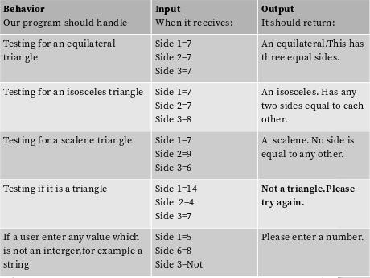

# The Triangle Tracker
#### The Triangle Tracker project.It's simply a website in which the user inputs three lengths of the triangle and it displays whether it is:an equilateral,an isosceles,a scalene or NO triangle at all. Running on latest HTML5.
#### By
Jasper Migiro only.
## Description
The Triangle Tracker project.It's simply a website in which the user inputs three lengths of the triangle and it displays whether it is:an equilateral,an isosceles,a scalene or NO triangle at all. Running on HTML5,CSS and Javascript.

## Setup/Installation Requirements
1.Modern Browser
2.PC or any electronic device with internet connection

## Known Bugs
No bugs so far. Working clean.
## Technologies Used
HTML5,CSS and Javascript
## Support and contact details
You can contact me via:
Email:jkmigiro@gmail.com
Mobile number:0724036732

### License

